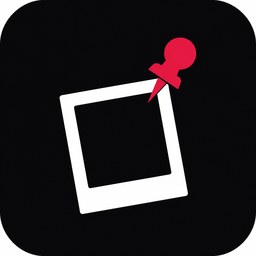

# Pngup

<table>
<tr>
<td width="110">

</td>
<td>

Pin a photo on your Windows desktop and work behind it.

**[Download latest release](https://github.com/DARKSIDE957/Pngup/releases/latest)**

Windows 10 / 11

</td>
</tr>
</table>

## About

Pngup keeps an image floating above your other windows. Good for reference photos, mockups, study notes, or anything you want visible while you work.

## Features

| | |
| :-- | :-- |
| Photo overlay | Always on top. Move, resize, and change opacity. |
| Click-through | Use apps behind the photo when you need to. |
| Settings ball | Small draggable panel you can place anywhere. |
| Themes | Dark and light. |
| Languages | English, Arabic, Spanish, French, German, Russian. |
| Tray menu | Quick actions from the notification area. |
| Persistence | Saves position, size, and preferences. |

## Install

1. Download the installer from [Releases](https://github.com/DARKSIDE957/Pngup/releases)
2. Run it and open Pngup
3. Pick a photo from the settings ball or tray menu
4. Drag the photo where you want it

## Shortcuts

| Key | Action |
| :-- | :-- |
| `Ctrl+O` | Pick photo |
| `Ctrl+T` | Toggle click-through |
| `Ctrl+Shift+H` | Show settings |
| `Ctrl+Shift+P` | Toggle click-through (global) |
| `Ctrl+Shift+O` | Pick photo (global) |

## Tray menu

Right-click the tray icon to show the photo, open settings, pick a photo, toggle click-through, switch theme, or quit.

## License

MIT
